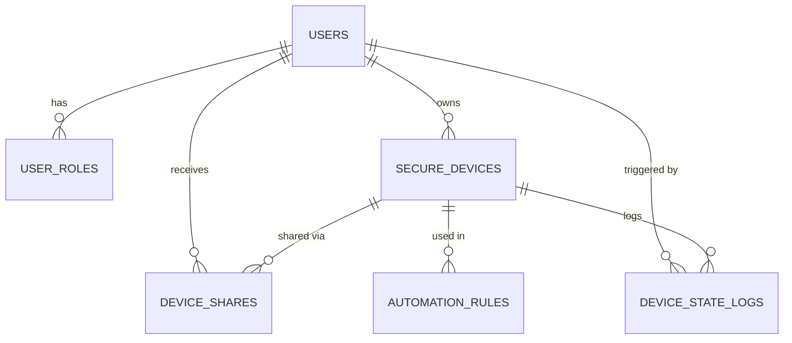

# 🏠 Home Automation System

A secure, multi-user **smart-home control platform** built with **Spring Boot**, **SQLite** and a dark-neon **vanilla JavaScript** dashboard. Every user controls only their own devices, and admins manage the whole system.

    

> Built as a **GUVI Java project submission**: *Online Home Automation Platform*.

<!-- Screenshots: add docs/images/login.png, dashboard.png, admin.png and link them here -->

---

## 📑 Table of Contents

[Problem Statement](#-problem-statement) · [Features](#-features) · [Tech Stack](#-tech-stack) · [Architecture](#-architecture) · [Packages](#-java-packages--key-classes) · [Roles](#-roles--permissions) · [Database](#-database-design) · [Quick Start](#-quick-start) · [Configuration](#-configuration) · [API](#-api-reference) · [Security](#-security-design) · [Troubleshooting](#-troubleshooting) · [Roadmap](#-roadmap)

---

## 🎯 Problem Statement

Most beginner "home automation" projects are single-user demos: anyone who opens the page can switch anything on or off, and there is no record of who did what.

Real homes and shared flats need more:

| Problem | How this project solves it |
|---|---|
| Anyone can control any device | **JWT login + role-based access** (`ADMIN`, `USER`) |
| One user can see another user's devices | **Strict per-user data isolation**: every device is tied to an owner email |
| No history of changes | **Activity logs** record every state change (who, when, old to new value) |
| Manual control only | **Automation rules**: "if trigger device crosses a threshold, run an action on another device" |
| No way to share a device safely | **Device sharing** with view / control / configure permissions |
| No management view for the owner of the system | **Admin panel** to manage users and see all devices and system stats |

**Goal:** a working, secure backend plus a lightweight web UI that demonstrates authentication, authorization, REST API design and relational data modelling in Java.

---

## ✨ Features

**User**
- Register, log in, stay authenticated with a 60-minute JWT
- Add, update, delete devices (light, fan, AC, sensors and more)
- Toggle ON/OFF, set values, change RGB colour
- Search and filter devices by room and state
- View per-device activity log
- Share devices with other users (view / control / configure)
- Create and delete automation rules

**Admin**
- List, create, edit, delete users
- Activate / deactivate accounts
- View all devices across all users
- View system statistics

**Platform**
- BCrypt-hashed passwords, JSON error responses for 401/403, CORS handling
- Responsive dashboard: stats cards, room filters, device tiles, activity terminal

---

## 🧰 Tech Stack

| Layer | Technology |
|---|---|
| Language / Build | Java 21, Maven |
| Framework | Spring Boot 3.5.5 |
| Web | `spring-boot-starter-web` (REST controllers) |
| Security | `spring-boot-starter-security`, custom JWT filter |
| JWT | `jjwt-api`, `jjwt-impl`, `jjwt-jackson` (0.11.5) |
| Persistence | `spring-boot-starter-data-jpa` (Hibernate) |
| Database | SQLite via `sqlite-jdbc` 3.46.1.3 + `hibernate-community-dialects` |
| Validation | `spring-boot-starter-validation` |
| Testing | `spring-boot-starter-test` |
| Frontend | HTML, CSS, vanilla JavaScript (no frameworks) |

---

## 🏗️ Architecture

```
Browser (static HTML/JS)
        │  Authorization: Bearer <JWT>
        ▼
JwtAuthenticationFilter ──► SecurityConfig (URL + role rules)
        ▼
   Controllers  ──►  Services  ──►  Repositories / DAOs  ──►  SQLite
 (REST, /api/**)   (business +      (Spring Data JPA)        ./data/home_automation.db
                    ownership checks)
```

---

## 📦 Java Packages & Key Classes

Base package: `com.example.homeautomation`

| Package | Responsibility | Key classes |
|---|---|---|
| *(root)* | App entry point | `HomeAutomationApplication` |
| `user` | Registration, login, JWT, user CRUD, seeding admin | `AuthController`, `AuthService`, `JwtTokenService`, `UserController`, `UserService`, `DataSeeder`, `LikeController` |
| `user.dto` | Request / response objects | `LoginRequest`, `RegisterRequest`, `AuthResponse` |
| `device` | Device model, state, colour, logs | `Device`, `DeviceController`, `OwnedDeviceController`, `OwnedDeviceService`, `DeviceService`, `DeviceRepository`, `DeviceState` |
| `security` | Secure (owner-bound) entities and services | `SecureUser`, `SecureDevice`, `DeviceShare`, `DeviceStateLog`, `SecureDeviceController`, `SecureDeviceService`, `JwtUserDetailsService` |
| `automation` | Automation rules | `AutomationRule`, `AutomationRuleController`, `AutomationRuleService`, `AutomationRuleDAO` |
| `admin` | Admin-only endpoints | `AdminController` |
| `config` | Security and cross-cutting setup | `SecurityConfig`, `JwtAuthenticationFilter`, `ApiExceptionHandler`, `JsonAuthenticationEntryPoint`, `JsonAccessDeniedHandler`, `ApiConfig` |
| `jdbc` | Direct DB connection helper | `DBConnection` |

---

## 👥 Roles & Permissions

| Capability | USER | ADMIN |
|---|:---:|:---:|
| Register / login | ✅ | ✅ |
| Manage **own** devices | ✅ | ✅ |
| View other users' devices | ❌ (only if shared) | ✅ |
| Share own devices | ✅ | ✅ |
| Automation rules | ✅ | ✅ |
| Manage users (create / edit / delete / activate) | ❌ | ✅ |
| System statistics | ❌ | ✅ |

- Anyone who self-registers is always a **USER**. A role sent by the client is ignored.
- The first **ADMIN** is created at startup from environment variables (see [Configuration](#-configuration)).
- Roles are stored without a prefix (`ADMIN`, `USER`); the JWT filter adds `ROLE_` once.

---

## 🗄️ Database Design

SQLite file: `./data/home_automation.db` (auto-created on first run; Hibernate manages tables).

### Entity relationships



### `users`: stores both admin and normal users

Admin and user live in the **same table**. What makes someone an admin is a row in `user_roles`.

```sql
CREATE TABLE users (
    email               VARCHAR(255) PRIMARY KEY,   -- unique identity & isolation key
    username            VARCHAR(100) NOT NULL UNIQUE,
    password            VARCHAR(255) NOT NULL,      -- BCrypt hash, never plain text
    first_name          VARCHAR(100) NOT NULL,
    last_name           VARCHAR(100) NOT NULL,
    active              BOOLEAN NOT NULL DEFAULT 1, -- admin can deactivate
    locked              BOOLEAN NOT NULL DEFAULT 0,
    failed_attempts     INTEGER DEFAULT 0,
    last_login          TIMESTAMP,
    last_failed_login   TIMESTAMP,
    last_password_change TIMESTAMP,
    created_at          TIMESTAMP NOT NULL,
    updated_at          TIMESTAMP NOT NULL
);

CREATE TABLE user_roles (
    user_email  VARCHAR(255) NOT NULL REFERENCES users(email),
    role        VARCHAR(50)  NOT NULL,              -- 'ADMIN' or 'USER'
    PRIMARY KEY (user_email, role)
);
```

Example seeded admin:

| email | username | role | active |
|---|---|---|---|
| value of `APP_ADMIN_EMAIL` | derived from it | `ADMIN` | 1 |

### `secure_devices`: every device belongs to exactly one owner

```sql
CREATE TABLE secure_devices (
    id                 INTEGER PRIMARY KEY AUTOINCREMENT,
    device_uid         VARCHAR UNIQUE NOT NULL,
    owner_email        VARCHAR NOT NULL REFERENCES users(email),  -- isolation anchor
    name               VARCHAR NOT NULL,
    type               VARCHAR NOT NULL,            -- LIGHT, FAN, AC, SENSOR ...
    subtype            VARCHAR,
    room               VARCHAR,
    state              VARCHAR NOT NULL DEFAULT 'OFF',
    value              INTEGER NOT NULL DEFAULT 0,
    red                INTEGER NOT NULL DEFAULT 255,
    green              INTEGER NOT NULL DEFAULT 255,
    blue               INTEGER NOT NULL DEFAULT 255,
    online             BOOLEAN DEFAULT 0,
    active             BOOLEAN NOT NULL DEFAULT 1,
    last_communication TIMESTAMP,
    capabilities       TEXT DEFAULT '{}',
    created_at         TIMESTAMP NOT NULL
);
```

### `device_shares`: controlled sharing

| Column | Meaning |
|---|---|
| `device_id`, `owner_email`, `shared_with_email` | what is shared, by whom, with whom |
| `can_view` (default 1), `can_control`, `can_configure` | permission flags |
| `expires_at`, `active`, `shared_at`, `revoked_at` | lifecycle of the share |

### `device_state_logs`: audit trail

| Column | Meaning |
|---|---|
| `device_id`, `owner_email` | which device, whose |
| `previous_state` / `new_state`, `previous_value` / `new_value` | what changed |
| `change_reason` | `MANUAL`, `AUTOMATION`, `SCHEDULED` |
| `triggered_by`, `automation_rule_id` | who or what caused it |
| `log_time`, `ip_address`, `user_agent`, `location` | context |

### `automation_rules`

| Column | Meaning |
|---|---|
| `triggerDeviceId`, `triggerType`, `threshold` | condition (e.g. sensor value above X) |
| `actionDeviceId`, `actionType` | what to do (e.g. turn device ON) |
| `active` | rule enabled or not |

> `devices` is a simpler legacy table (`name`, `state`, `controlType`, `sensorType`, `value`, RGB) kept for the basic device endpoints. The `secure_*` tables are the owner-bound model used for multi-user isolation.
> Reference SQL scripts are in `src/main/resources/` (`schema_v2_secure.sql` and others).

---

## 🚀 Quick Start

**Prerequisites:** JDK 21, Maven 3.8+. (Helper scripts are Windows `.bat`; on Linux/macOS use the manual commands.)

```bash
git clone https://github.com/neerajkumar-rs/java_home_automation.git
cd java_home_automation
```

**Option A: Windows script** (port 8081)

```bat
scripts\start-app-8081.bat
```

**Option B: Manual**

```bash
# Windows (cmd):  set JWT_SECRET=your-random-string-of-32-or-more-characters
# Linux / macOS:  export JWT_SECRET=your-random-string-of-32-or-more-characters

mvn clean package -DskipTests
java -jar target/home-automation-0.0.1-SNAPSHOT.jar --server.port=8081
```

Open **http://localhost:8081** → register → log in → dashboard.

---

## ⚙️ Configuration

| Variable | Required | Description |
|---|---|---|
| `JWT_SECRET` | ✅ | Token signing key, 32+ characters. App refuses to start without it. |
| `APP_ADMIN_EMAIL` | Optional | Email of the first admin, created at startup if no users exist. |
| `APP_ADMIN_PASSWORD` | Optional | Password for that admin. |
| `PORT` | Optional | Server port (default `8080`). |

Spring profiles: `application-admin`, `application-user`, `application-prod` (`prod` uses `ddl-auto=validate` so Hibernate never changes the schema). Never commit real secrets.

---

## 🔌 API Reference

All endpoints require `Authorization: Bearer <token>` except register, login and validate.

**Auth** `/api/auth`

| Method | Endpoint | Description |
|---|---|---|
| POST | `/register` | Create a USER account |
| POST | `/login` | Returns JWT |
| GET | `/validate` | Check a token |
| GET | `/me` | Current user |

**Devices** `/api/devices`

| Method | Endpoint | Description |
|---|---|---|
| GET / POST | `/` | List own devices / add device |
| GET / PUT / DELETE | `/{id}` | Read / update / delete |
| POST | `/{id}/state` | Turn ON/OFF or set value |
| POST | `/{id}/color` | Set RGB colour |
| GET | `/{id}/logs` | Activity log |

**Secure devices** `/api/v1/secure/devices`: owner-checked operations incl. `/owned`, `/shared`, `/search`, `/statistics`, `/{id}/permission`.

**Automation** `/api/automation-rules`

| Method | Endpoint | Description |
|---|---|---|
| GET / POST | `/` | List / create rule |
| DELETE | `/{id}` | Delete rule |

**Admin 🔒 ADMIN only** `/api/admin`

| Method | Endpoint | Description |
|---|---|---|
| GET / POST | `/users` | List / create users |
| GET / PUT / DELETE | `/users/{id}` | Read / update / delete user |
| POST | `/users/{id}/activate` · `/deactivate` | Enable or disable account |
| GET | `/devices` | All devices |
| GET | `/system/stats` | System statistics |

Example:

```bash
curl -X POST http://localhost:8081/api/auth/login \
  -H "Content-Type: application/json" \
  -d '{"email":"you@example.com","password":"yourPassword"}'
```

---

## 🔐 Security Design

- **Stateless JWT** (60 min expiry) verified on every request by `JwtAuthenticationFilter`
- **BCrypt** password hashing; account lock and failed-attempt tracking fields
- **Role rules** in `SecurityConfig`: `/api/admin/**` requires `ADMIN`
- **Ownership checks** in services: a user can only touch rows where `owner_email` matches their token
- **No default secret**: `JWT_SECRET` must come from the environment
- Client-supplied roles on registration are ignored
- Details: [`docs/DataIsolationStrategy.md`](docs/DataIsolationStrategy.md)

---

## 📁 Project Structure

```
├── src/main/java/com/example/homeautomation/   # packages listed above
├── src/main/resources/
│   ├── static/        # login, register, dashboard, admin pages + JS/CSS
│   ├── application*.properties
│   └── *.sql          # reference schemas
├── scripts/           # Windows start / stop / test helpers
├── docs/              # design docs
└── pom.xml
```

---

## 🛠️ Troubleshooting

| Problem | Fix |
|---|---|
| Startup error about JWT secret | Set `JWT_SECRET` (32+ chars) |
| Port already in use | Stop the other process or change `--server.port` |
| Build fails | Confirm `java -version` is 21, then `mvn clean package -DskipTests` |
| 401 after some time | Token expired (60 min). Log in again |
| No admin account | Set `APP_ADMIN_EMAIL` and `APP_ADMIN_PASSWORD` before the first run with an empty DB |

---

## 🗺️ Roadmap

- [ ] Real device integration (MQTT / ESP32)
- [ ] Unit and integration test coverage
- [ ] Docker support
- [ ] Cross-platform start scripts
- [ ] Refresh tokens and password reset

---

## 🤝 Contributing

Fork → create a branch → commit → open a Pull Request.

## 📄 License

MIT. See [LICENSE](LICENSE). © 2026 Neeraj Kumar
